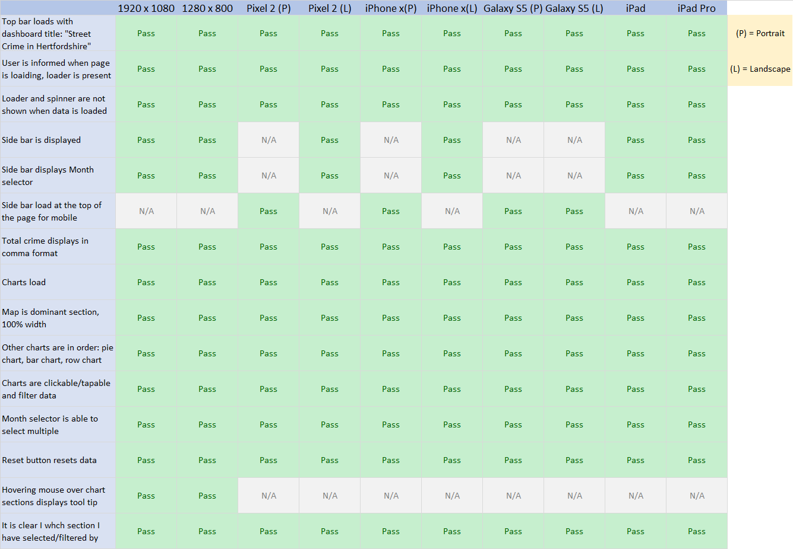

# Testing

## Automatic testing

I have run the HTML file through [W3C HTML Validation tool](https://validator.w3.org/), passing.

I have run the CSS file through [W3C CSS Validation tool](https://jigsaw.w3.org/css-validator/), passing.

Site's accessibility has been checked and updated using [Axe](https://www.deque.com/axe/) by [Deque](https://www.deque.com/), to access the accessibility of the website for screen readers and other disabilities.

SCSS has been compiled to CSS and auto-prefixed with [Live SASS compilier](https://github.com/ritwickdey/vscode-live-sass-compiler) for VScode. 
This ensures the CSS will work on a multitude of browsers.

## Manual testing

A full set of manual tests have been carried on different screen sizes on Chrome browser.
See below for chart of outcomes.

